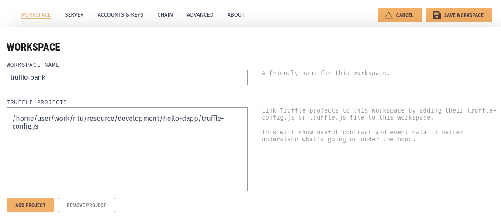
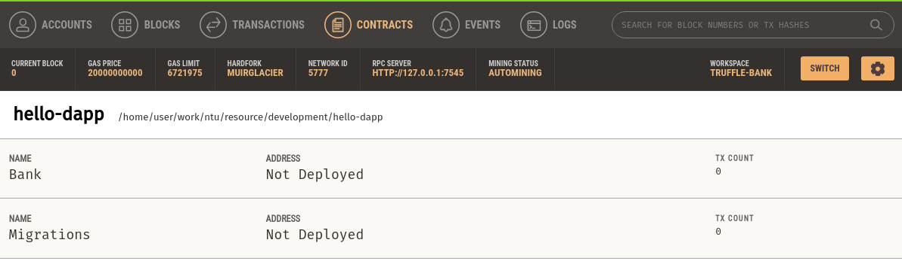
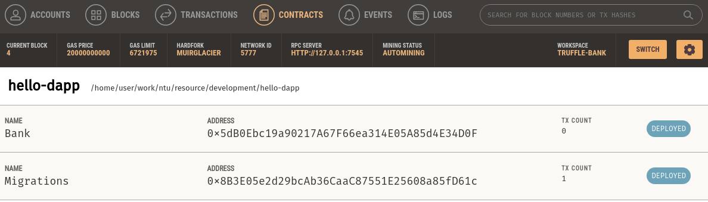

# How to build a dApp -- a minimally sufficient guide

This is a hands-on workshop for CZ4153/CE4153, aiming to introduce some commonly used tools and libraries for building a full-blown dApp on Ethereum.

We will cover:

- How to use [truffle framework](https://www.trufflesuite.com/docs/truffle/overview) for smart contract development
- How to use [ganache](https://www.trufflesuite.com/docs/ganache/overview) for local testing
- How to deploy your smart contract to live testnet(s)
- How to use [web3](https://web3js.readthedocs.io/en/v1.2.11/getting-started.html) or [ethers.js](https://github.com/ethers-io/ethers.js/) to connect to your smart contract on chain

We assume you already understand the following, thus will _NOT_ cover:

- How Ethereum blockchain work
- How to write Solidity smart contract

## Concepts Overview

Read through [this](./Workshop-dApp.pdf) brief introduction of key concepts of dApp development first

## Step 0: Prerequisite & Installation

Make sure the following are installed:

- [node](https://nodejs.org/en/) v8.9.4 or later
- [npm](https://www.npmjs.com/get-npm) or [yarn](https://classic.yarnpkg.com/en/docs/install/) (you can test by running `npm -v` or `yarn -v`)

Next, install truffle:

```sh
npm install truffle -g # or if you're using yarn: yarn global add truffle
truffle version # ensure successful installation
```

Then, install ganache [here](https://www.trufflesuite.com/ganache).

## Step 1: Write Smart Contracts

Create your own project folder and create a truffle project inside:

```sh
mkdir -p <PATH-TO-YOUR-PROJECT>/<PROJECT-REPO>/ && cd <PATH-TO-YOUR-PROJECT>/<PROJECT-REPO>/
git init
truffle init
```

Now your folder structure should look like:

```sh
├── contracts # this is where your smart contracts will go
│   └── Migrations.sol
├── migrations # this is where your deployment scripts will go
│   └── 1_initial_migration.js
├── test # this is where your unit tests will go
└── truffle-config.js # this is Truffle configuration file, default comments explain available options
```

Write/Add your simple [./contracts/Bank.sol](./contracts/Banks.sol) contract.

Try to compile your contracts:

```sh
truffle compile
```

Now you should see a new folder named `build/` inside which are `Bank.json` and `Migrations.json` -- these are the **artifacts** of your contracts, and you **should never edit them** manually, as they are used by the truffle framework during deployment etc.

## Step 2: Migrate/Deploy Your Smart Contracts Locally

### Step 2.1: Start Your Local Blockchain

Start your Ganache by double clicking the downloaded app image during installation.

Click on "New Workspace (Ethereum)", which will create a running instance of Ethereum node locally -- together with 10 accounts created, each with 100 ETH balance for you to play with during tests

Next, we need to link our truffle project with our local ganache blockchain, by specifying a customized workspace name and the path to our `truffle-config.js`.
(You can name your project whatever you like, for our case, we will just use "truffle-bank")



Inside the Ganache app, explore around a little bit by yourself, when in doubt of certain button or functionality, please consult [the official doc](https://www.trufflesuite.com/docs/ganache/overview).

Now, try to navigate to "Contracts" tab, under which you will see our `Migrations.sol` and `Bank.sol`, both of which has a status of "Not deployed" -- meaning they have not be deployed to our local blockchain yet, and the reason why ganache knows our freshly written contracts exist due to the linking via `truffle-config.js`.



### Step 2.2: Specify Your Deployment Scripts

For first time truffle users, terms like "artifacts", "migration" might sound foreign.
"Migration" is interchangeably equivalent to "Deployment" -- when you finish writing your contracts, you need to deploy it to the blockchain (our local instance in this case).

There are many possible different requirements Truffle prepares for when deploying a bunch of smart contracts:

- the same contract might be updated in the future and re-deployed
- the order of the contracts deployment (imagine you have 50 contracts because your business logic is complex) needs to be customizeable since they might have internal dependencies on each other
- some contracts are [library](https://solidity.readthedocs.io/en/v0.7.1/contracts.html?#libraries) which requires dynamic linking (we can ignore this for this workshop)

In our case, Truffle has already added the deployment of `Migrations.sol` by default.
This contract is offered by Truffle framework at initialization to help manage our contracts, and we can ignore for now.

All we need is to add migration scripts for our own `Bank.sol` in [./migrations/2_bank.js](./migrations/2_bank.js):

```javascript
// this script will be run after 1_initial_migration.js
// as you guessed, the naming convention which starts with a number, e.g. "1_xxx.js", tells Truffle the order
// by which it should run these migration scripts.

const Bank = artifacts.require("Bank"); // importing artifacts from Truffle compile

module.exports = function (deployer) {
  // deployer is an object provided by Truffle to handle migration
  deployer.deploy(Bank); // now, we ask deployer to deploy our Bank.sol contract
};
```

Now, we can deploy our contracts:

```sh
truffle migrate
```

Make sure you read the printed output message log in your terminal, they can help you understand what's happening under the hood.

- First, it compiles your contracts;
- then it starts the migration by pinpointing the right network (i.e. our local ganache blockchain instance);
- then it runs `1_initial_migration.js` and deployed `Migrations.sol`, this creates a transaction in the blockchain, thus you can see the `block_number: 1` as well as gas cost for this transaction `gas used: xxxx ... total cost: 0.000xxxx ETH`;
- then it runs `2_bank.js` and deployed `Bank.sol`, this creates another transaction.

Now, go back to your Ganache app, you should see that the first account had spent some Ether to deploy these two contracts with a remaining balance < 100 ETH.
Navigate to "Contracts" tab, you will see contracts' respective address.



Don't be intimated, we can always start simple and slowly explore the rest, the deployment scripts we are using for this workshop is minimal and trivial to understand semantically.
When in doubt, check [docs on different deployment options/capability](https://www.trufflesuite.com/docs/truffle/getting-started/running-migrations)

## Step 3:

## Step 4:
