# How to build a dApp -- a minimally sufficient guide

This is a hands-on workshop for CZ4153/CE4153, aiming to introduce some commonly used tools and libraries for building a full-blown dApp on Ethereum.

We will cover:

- How to use [truffle framework](https://www.trufflesuite.com/docs/truffle/overview) for smart contract development
- How to use [ganache](https://www.trufflesuite.com/docs/ganache/overview) for local testing
- How to deploy your smart contract to live testnet(s)
- How to use [web3](https://web3js.readthedocs.io/en/v1.2.11/getting-started.html) or [ethers.js](https://github.com/ethers-io/ethers.js/) to connect to your smart contract on chain

We assume you already understand the following, thus will _NOT_ cover:

- How Ethereum blockchain work
- How to write Solidity smart contract

## Concepts Overview

Read through [this](./Workshop-dApp.pdf) brief introduction of key concepts of dApp development first

## Step 0: Prerequisite & Installation

Make sure the following are installed:

- [node](https://nodejs.org/en/) v8.9.4 or later
- [npm](https://www.npmjs.com/get-npm) or [yarn](https://classic.yarnpkg.com/en/docs/install/) (you can test by running `npm -v` or `yarn -v`)
- [MetaMask Extension](https://metamask.io/download.html) and created at least 1 account

Next, install truffle:

```sh
npm install truffle -g # or if you're using yarn: yarn global add truffle
truffle version # ensure successful installation
```

Then, install ganache [here](https://www.trufflesuite.com/ganache).

## Step 1: Write Smart Contracts

Create your own project folder and create a truffle project inside:

```sh
mkdir -p <PATH-TO-YOUR-PROJECT>/<PROJECT-REPO>/ && cd <PATH-TO-YOUR-PROJECT>/<PROJECT-REPO>/
git init
truffle init
```

Now your folder structure should look like:

```sh
├── contracts # this is where your smart contracts will go
│   └── Migrations.sol
├── migrations # this is where your deployment scripts will go
│   └── 1_initial_migration.js
├── test # this is where your unit tests will go
└── truffle-config.js # this is Truffle configuration file, default comments explain available options
```

Write/Add your simple [./contracts/Bank.sol](./contracts/Banks.sol) contract.

Try to compile your contracts:

```sh
truffle compile
```

Now you should see a new folder named `build/` inside which are `Bank.json` and `Migrations.json` -- these are the **artifacts** of your contracts, and you **should never edit them** manually, as they are used by the truffle framework during deployment etc.

## Step 2: Migrate/Deploy Your Smart Contracts Locally

### Step 2.1: Start Your Local Blockchain

Start your Ganache by double clicking the downloaded app image during installation.

Click on "New Workspace (Ethereum)", which will create a running instance of Ethereum node locally -- together with 10 accounts created, each with 100 ETH balance for you to play with during tests

Next, we need to link our truffle project with our local ganache blockchain, by specifying a customized workspace name and the path to our `truffle-config.js`.
(You can name your project whatever you like, for our case, we will just use "truffle-bank")


Inside the Ganache app, explore around a little bit by yourself, when in doubt of certain button or functionality, please consult [the official doc](https://www.trufflesuite.com/docs/ganache/overview).

Now, try to navigate to "Contracts" tab, under which you will see our `Migrations.sol` and `Bank.sol`, both of which has a status of "Not deployed" -- meaning they have not be deployed to our local blockchain yet, and the reason why ganache knows our freshly written contracts exist due to the linking via `truffle-config.js`.


### Step 2.2: Specify Your Deployment Scripts

For first time truffle users, terms like "artifacts", "migration" might sound foreign.
"Migration" is interchangeably equivalent to "Deployment" -- when you finish writing your contracts, you need to deploy it to the blockchain (our local instance in this case).

There are many possible different requirements Truffle prepares for when deploying a bunch of smart contracts:

- the same contract might be updated in the future and re-deployed
- the order of the contracts deployment (imagine you have 50 contracts because your business logic is complex) needs to be customizeable since they might have internal dependencies on each other
- some contracts are [library](https://solidity.readthedocs.io/en/v0.7.1/contracts.html?#libraries) which requires dynamic linking (we can ignore this for this workshop)

In our case, Truffle has already added the deployment of `Migrations.sol` by default.
This contract is offered by Truffle framework at initialization to help manage our contracts, and we can ignore for now.

All we need is to add migration scripts for our own `Bank.sol` in [./migrations/2_bank.js](./migrations/2_bank.js):

```javascript
// this script will be run after 1_initial_migration.js
// as you guessed, the naming convention which starts with a number, e.g. "1_xxx.js", tells Truffle the order
// by which it should run these migration scripts.

const Bank = artifacts.require("Bank"); // importing artifacts from Truffle compile

module.exports = function (deployer) {
  // deployer is an object provided by Truffle to handle migration
  deployer.deploy(Bank); // now, we ask deployer to deploy our Bank.sol contract
};
```

Now, we can deploy our contracts:

```sh
truffle migrate
```

Make sure you read the printed output message log in your terminal, they can help you understand what's happening under the hood.

- First, it compiles your contracts;
- then it starts the migration by pinpointing the right network (i.e. our local ganache blockchain instance);
- then it runs `1_initial_migration.js` and deployed `Migrations.sol`, this creates a transaction in the blockchain, thus you can see the `block_number: 1` as well as gas cost for this transaction `gas used: xxxx ... total cost: 0.000xxxx ETH`;
- then it runs `2_bank.js` and deployed `Bank.sol`, this creates another transaction.

Now, go back to your Ganache app, you should see that the first account had spent some Ether to deploy these two contracts with a remaining balance < 100 ETH.
Navigate to "Contracts" tab, you will see contracts' respective address.


Don't be intimated, we can always start simple and slowly explore the rest, the deployment scripts we are using for this workshop is minimal and trivial to understand semantically.
When in doubt, check [docs on different deployment options/capability](https://www.trufflesuite.com/docs/truffle/getting-started/running-migrations)

## Step 3: Write Unit Tests

Without unit tests, we won't be confident that our code works as we expect.
Writing unit tests as we implement functionalities into our smart contract from the very beginning is the best practice. (make sure each modular components/functions work as expected, producing the desired input-output relationship)

Please take a look at [.test/bank.js](./test/bank.js) for an unit test example.

If you are a JavaScript developer, the overall structure and keywords like `it`, `describe`, `assert`, `expect` might already sounds familiar.
If not, please read ["Writing tests in Truffle using JavaScript"](https://www.trufflesuite.com/docs/truffle/testing/writing-tests-in-javascript) to get detailed information, or alternatively, you could learn by reading the given example with rich commentaries of what's going on.

To run these tests:

```sh
truffle test
```

which should output something similar to:

```sh
  Contract: Bank
    ✓ should make deployer the owner
    ✓ can deposit correctly (98ms)
    ✓ can withdraw less than despoited (131ms)

  3 passing (302ms)
```

## Step 4: Deploy Contracts To Testnet

**Only deploy your smart contracts to testnet when you have extensively tested all your functionalities**!

For example, our current example tests are not extensive enough, we haven't tested many other cases like "transaction should fail when someone try to withdraw more than he/she deposited", or the case "transaction should fail when someone try to deposit 0 or non-positive amount".

### Step 4.1 Choose a Testnet

You can randomly choose from one of Goerli, Ropsten, Kovan, and Rinkby.
They are no big differences among them technically wise, some are more community driven while others are backed by few key companies.

We will choose Ropsten testnet for this tutorial.

### Step 4.2 Get Ether From Testnet Faucet

Testnet are just like mainnet except that

- it's not running an expensive PoW or PoS consensus, only a few (<10) nodes dictates a much faster, yet centralized mining process -- so-called "Proof of Authority";
- and that money on testnet are worthless, and only for experiment/testing purpose.

To get the "fake" testnet ether, you need to go to the respective **faucet** (just search "XXX testnet faucet").

In Ropsten case, you can find [this faucet](https://faucet.ropsten.be/).
Copy your account from MetaMask and paste into input field, then click "Send me test Ether".
Wait for a while, and you should see your balance increased in Metamask wallet.

Please be noted that some testnet would require some form of social proofs to get test ether to prevent DoS attack; some may require you to wait for a few minutes; almost all have a rate limit (at most request X test ether in Y hours).


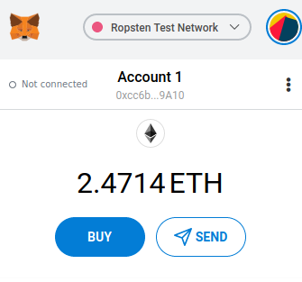

### Step 4.3 Register an Infura Account

Register [an account here](https://infura.io/register), then "Create New Project" with an arbitrary project name,
navigate to "Setting" tab inside the project you just created, you should see something similar to:

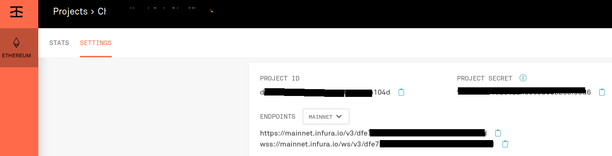

### Step 4.4 Modify your `truffle-config.js`

un-comment the following two sections of the `truffle-config.js` file at the root of your project folder.

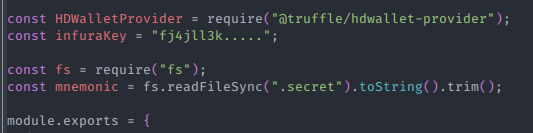
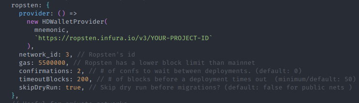

Fill in your own `YOUR-PROJECT-ID` and `infuraKey` (i.e. "Project Secret") as shown in the infura portal in the last step.

Create a file named `.secret`, copy paste your MetamMsk mnemonic seed into this file. (1. remember to gitignore this sensitive file; 2. to find out about your seed, go to MetaMask top right "Settings > Security & Privacy > Reveal Seed Phrase")

Add `HDWalletProvider` dependency:

```sh
npm install @truffle/hdwallet-provider # or: yarn add @truffle/hdwallet-provider
```

### Step 4.5 Deploy away

Run:

```sh
truffle migrate --network ropsten # or other testnet name specified in your `truffle-config.js`
```

If your terminal returns success, then your contracts are deployed, you can find their respective addresses in the logs output.

There are two ways to double check:

1. Go to MetaMask, click on "View on EtherScan", you should be able to see 4 recent transactions -- 2 are marked as "Contract Creation" (since we have two contracts), the other 2 are init calls which invokes the [constructor](https://solidity.readthedocs.io/en/v0.7.1/contracts.html?#constructors) of the smart contracts.

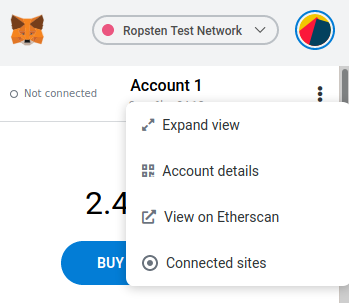
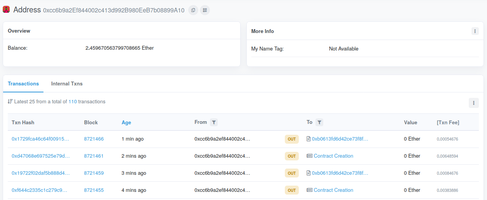

2. Copy the "contract address: 0xba..." from the terminal output and go to [EtherScan](https://ropsten.etherscan.io/) and directly search for them:

```sh
   Deploying 'Bank'
   ----------------
   > transaction hash:    0xd47068e697525e79db5e0451467be90b89a33df2769335c4847eb405936b2c6b
    > Blocks: 2            Seconds: 33
   > contract address:    0xB280Db02eFdb0c940926d7B92F9Fc24aBffaa9C2 # COPY THIS ONE!!!
   > block number:        8721461
   > block timestamp:     1600614039
   > account:             0xcc6b9a2Ef844002c413d992B980EeB7b08899A10
   > balance:             2.460217323799708665
   > gas used:            324297 (0x4f2c9)
   > gas price:           20 gwei
   > value sent:          0 ETH
   > total cost:          0.00648594 ETH
```

Here's the [searched result](https://ropsten.etherscan.io/address/0xB280Db02eFdb0c940926d7B92F9Fc24aBffaa9C2).

## Step 5: Connecting Front-end Using web3.js or ethers.js

You can use any front end framework you want (e.g. React, Angular, Vuejs, Emberjs etc.).

In this tutorial, we will just use extreme bare-bone [React App](https://reactjs.org/) for simplicity, and only demonstrate how to use **web3.js** since using _ethers.js_ is very similar experience.

The main file to learn from is [bank.js](./webapp/bank.js):

```js
import Web3 from "web3";
// ...
const web3 = new Web3(
  Web3.currentProvider || new Web3.providers.WebsocketProvider(infuraWSS)
);
// doc here: https://web3js.readthedocs.io/en/v1.2.11/web3.html#providers
const contract = new web3.eth.Contract(artifact.abi, BankContractAddress);

export const updateDeposit = async (addr) => {
  // doc here: https://web3js.readthedocs.io/en/v1.2.11/web3-eth-contract.html#methods-mymethod-call
  const newBalance = await contract.methods.balance().call({ from: addr });
  return { address: addr, deposit: newBalance };
};

export const newDeposit = async (amount) => {
  // Using MetaMask API to send transaction
  //
  // please read: https://docs.metamask.io/guide/ethereum-provider.html#ethereum-provider-api
  const provider = await detectEthereumProvider();
  if (provider) {
    // From now on, this should always be true:
    // provider === window.ethereum
    ethereum.request({
      method: "eth_sendTransaction",
      params: [
        {
          from: ethereum.selectedAddress,
          to: BankContractAddress,
          value: web3.utils.toWei(amount),
          data: web3.eth.abi.encodeFunctionCall(
            {
              name: "deposit",
              type: "function",
              inputs: [],
            },
            []
          ), // https://web3js.readthedocs.io/en/v1.2.11/web3-eth-abi.html#encodefunctioncall
          chainId: 3, // ropsten
        },
      ],
    });
  } else {
    console.log("Please install MetaMask!");
  }
};
```

`updateDeposit` demonstrates how you can read from blockchain with Infura web socket provider;
`newDeposit` demonstrates how you can send transaction to contract on ropsten via MetaMask.

To view our web app locally, start the web app and view [here](http://localhost:1234):

```sh
npm start # or: yarn start
```

You should be able to query deposit of any address:

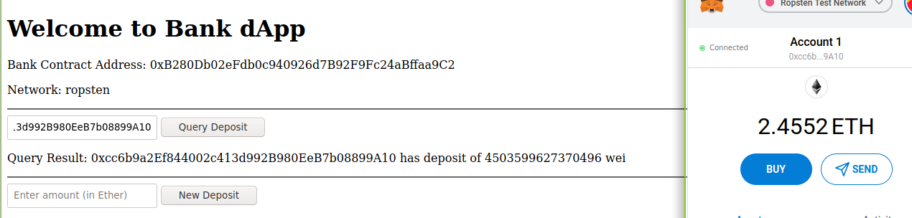

To actually send transaction, we can use MetaMask's API and UI (see more links in the comments in our `webapp/bank.js`).

First, we need to connect our MetaMask extension to our localhost site:

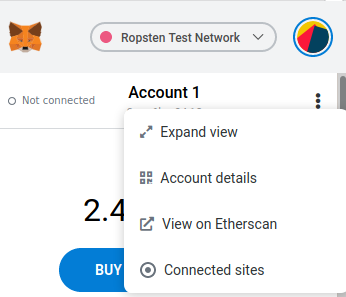
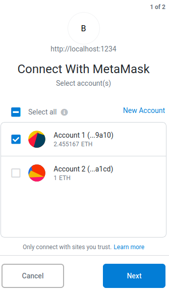


Finally, let's deposit some of our test Ether to our `Bank.sol` contract on the live ropsten testnet:

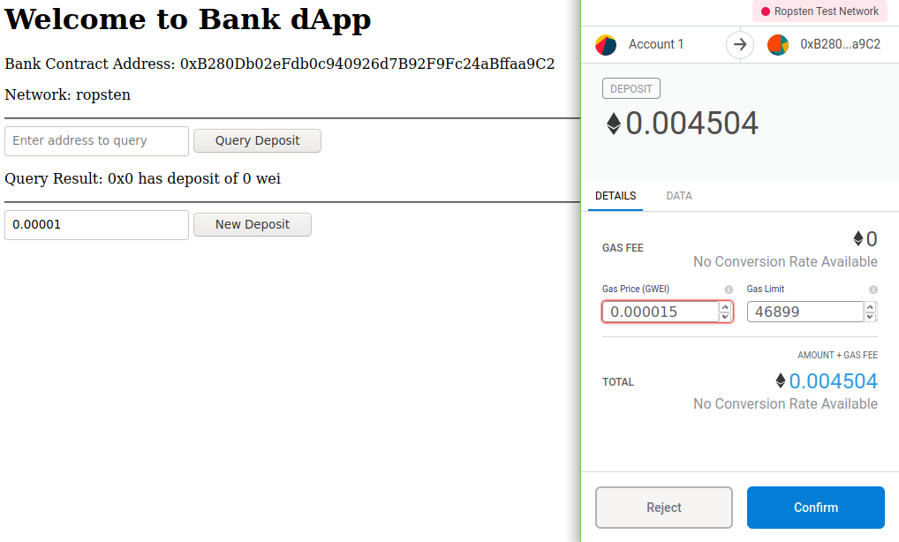

Lastly, let's confirm that our deposit increased by querying again:
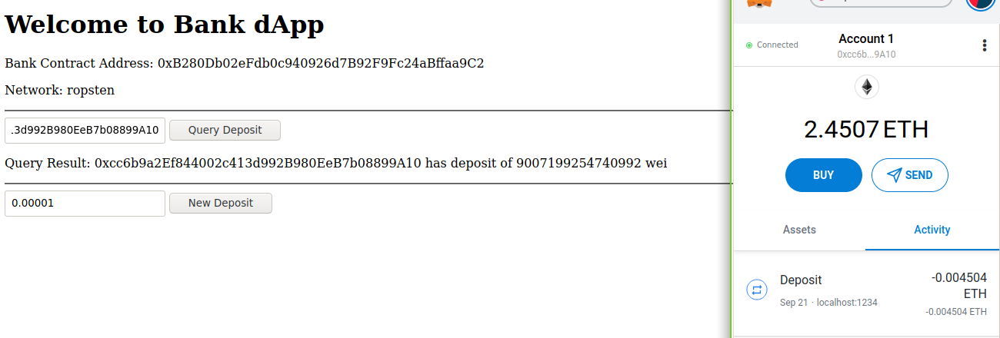

## Step 6: Launch 🚀 & Celebrate 🥂

## Additional Resources

- If you're using React, consider using: [web3-react](https://github.com/NoahZinsmeister/web3-react) or [create-eth-app](https://github.com/PaulRBerg/create-eth-app)
- If you're using React and want to use Truffle's native support, you can try [Drizzle](https://www.trufflesuite.com/docs/drizzle/overview), it has quite a few good examples to follow to set up your own front end app.
- If you want a ["Connect to MetaMask" button](https://docs.metamask.io/guide/accessing-accounts.html) instead of asking users to manually connect, see this blog [here](https://docs.metamask.io/guide/create-dapp.html#basic-action-part-1).
